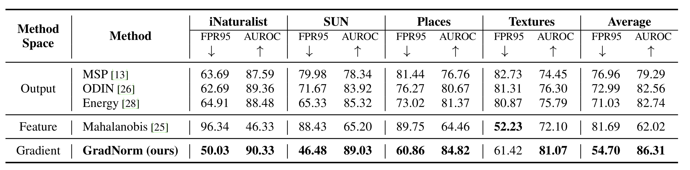

# On the Importance of Gradients for Detecting Distributional Shifts in the Wild

This is the source code for our paper:
[On the Importance of Gradients for Detecting Distributional Shifts in the Wild](https://arxiv.org/abs/2110.00218)
by Rui Huang, Andrew Geng, and Sharon Li.
Code is modified from [Google BiT](https://github.com/google-research/big_transfer),
[ODIN](https://github.com/facebookresearch/odin),
[Outlier Exposure](https://github.com/hendrycks/outlier-exposure),
[deep Mahalanobis detector](https://github.com/pokaxpoka/deep_Mahalanobis_detector),
[Robust OOD Detection](https://github.com/jfc43/robust-ood-detection)
and [MOS](https://github.com/deeplearning-wisc/large_scale_ood).

While previous works mainly rely on output space or feature space to detect out-of-distribution (OOD) inputs,
this work proposes a novel gradient-based approach for OOD detection.


## Usage

### 1. Dataset Preparation

#### In-distribution dataset

Please download [ImageNet-1k](http://www.image-net.org/challenges/LSVRC/2012/index) and place the training data and validation data in
`./dataset/id_data/ILSVRC-2012/train` and  `./dataset/id_data/ILSVRC-2012/val`, respectively.

#### Out-of-distribution dataset
Following [MOS](https://arxiv.org/pdf/2105.01879.pdf), we use the following 4 OOD datasets for evaluation:
[iNaturalist](https://arxiv.org/pdf/1707.06642.pdf), 
[SUN](https://vision.princeton.edu/projects/2010/SUN/paper.pdf), 
[Places](http://places2.csail.mit.edu/PAMI_places.pdf), 
and [Textures](https://arxiv.org/pdf/1311.3618.pdf).

For iNaturalist, SUN, and Places, we have sampled 10,000 images from the selected concepts for each dataset,
which can be download from the following links:
```bash
wget http://pages.cs.wisc.edu/~huangrui/imagenet_ood_dataset/iNaturalist.tar.gz
wget http://pages.cs.wisc.edu/~huangrui/imagenet_ood_dataset/SUN.tar.gz
wget http://pages.cs.wisc.edu/~huangrui/imagenet_ood_dataset/Places.tar.gz
```

For Textures, we use the entire dataset, which can be downloaded from their
[official website](https://www.robots.ox.ac.uk/~vgg/data/dtd/).

Please put all downloaded OOD datasets into `./dataset/ood_data/`.
For more details about these OOD datasets, please check out the [MOS paper](https://arxiv.org/pdf/2105.01879.pdf).


### 2. Pre-trained Model Preparation

We omit the process of pre-training a classification model on ImageNet-1k.
For the ease of reproduction, we provide our pre-trained network below:
```bash
wget http://pages.cs.wisc.edu/~huangrui/finetuned_model/BiT-S-R101x1-flat-finetune.pth.tar
```
Put the downloaded model in `./checkpoints/pretrained_models`.

For more diverse pre-trained models, one can also refer to
[BiT-S pre-trained model families](https://github.com/google-research/big_transfer).


### 3. OOD Detection Evaluation

To reproduce our GradNorm results, please run:
```
./scripts/test.sh GradNorm iNaturalist(/SUN/Places/Textures)
```

To reproduce baseline approaches, please run:
```
./scripts/test.sh MSP(/ODIN/Energy/Mahalanobis) iNaturalist(/SUN/Places/Textures)
```

#### Note for Mahalanobis
Before testing, make sure you have tuned and saved its hyperparameters first by running:
```
./scripts/tune_mahalanobis.sh
```

## OOD Detection Results

GradNorm achieves state-of-the-art performance averaged on the 4 OOD datasets.



## Citation

If you find our codebase useful, please cite our work:
```
@inproceedings{huang2021importance,
  title={On the Importance of Gradients for Detecting Distributional Shifts in the Wild},
  author={Huang, Rui and Geng, Andrew and Li, Yixuan},
  booktitle={Advances in Neural Information Processing Systems},
  year={2021}
}
```
